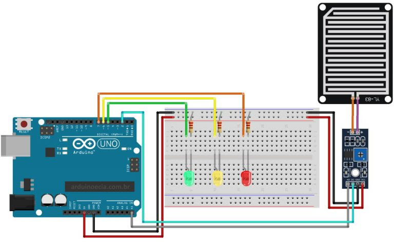

# Dector de Chuva Projeto Agrinho Robotica

O sistema identifica a umidade do ar, conforme a umidade aumenta as luzes acendem, ajudando a identicar um possivel temporal, assim ajudando pessoas que moram em áreas rurais a evitar chuvas.

* **Luz Verde** Umidade alta
* **Luz Amarela** Umidade média
* **Luz vermelha** Umidade baixa

# Montagem

Teste o seu módulo com apenas 3 leds e 3 resistores, montando o circuito abaixo. O módulo pode ser alimentado com tensão entre 3.3 e 5 volts:

O sensor de chuva para Arduino é um componente com duas partes: a placa do sensor, formada por várias trilhas resistentes à oxidação, que vão detectar o nível de líquido que está atingindo a placa, e o módulo com chip comparador LM393, que é o responsável por ler as informações desse sensor e enviar os dados pelas pinos A0 (analógico), ou D0 (digital – valores 0 e 1).

O programa de teste lê as informações do sensor e acende os leds de acordo com o nível de líquido detectado. Os valores são lidos em uma série de comandos IF (SE), que podem ser acrescentados ou alterados de acordo com o nível de precisão desejada.
