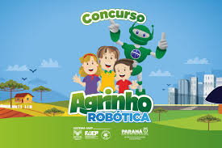

# Dector de Chuva Projeto Agrinho Robotica

O sistema identifica a umidade do ar, conforme a umidade aumenta as luzes acendem, ajudando a identicar um possivel temporal, assim ajudando pessoas que moram em áreas rurais a evitar chuvas.

Text content

* **Luz Verde** Umidade alta
* **Luz Amarela** Umidade média
* **Luz vermelha** Umidade baixa
